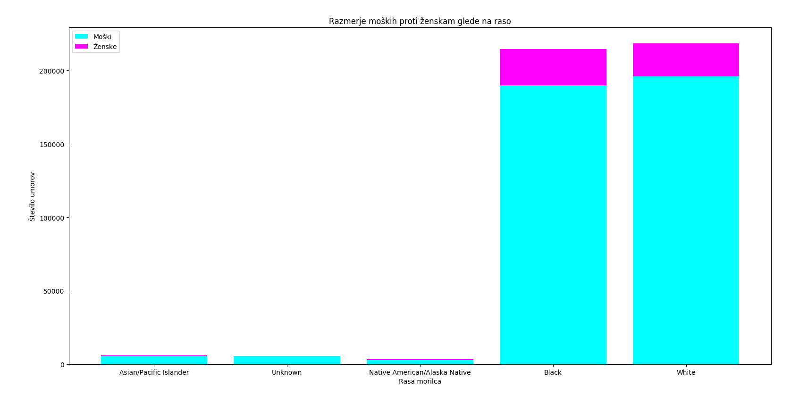

# Analiza umorov v ZDA [1980-2014]

## Opis problema

S strani kaggle smo vzeli dataset vseh umorov v ZDA od leta 1980 do 2014. Ta vsebuje več kot 610000 zapisov o kriminalnih aktivnostih, ki so se končale s smrtnim izzidom.

Zastavili smo si sledeča vprašanja/cilje:
- [ ] Razmerje rešenih primerov med tipi policije rezdeljene po državah,
- [ ] Povezava med spolom in uporabljenim orožjem,
- [ ] Ali obstaja povezava med policijami, ki so umor rešili uspešno in raso napadalca
- [ ] Iskanje povezav med umori in napadalcem.

## Podatki

Med podatki je veliko vrednosti atributov "Unknown", verjetno zaradi nepopolnih poročil ali napak pri vnosih pri digitalizaciji.
Pojavijo se tudi primeri, kjer je število žrtev 0 ali je število napadalcev 0, obstajajo pa tudi zapisi, kjer ni
žrtev niti napadalca. Oziroma so to manjkajoči podatki. Manjka pribljižno **18.93% podatkov** _(všteti samo spol, etnična
pripadnost, starost, rasa, število žrtev ali storilcev)_. So pa vsi podatki, kar se tiče leta, meseca, države, mesta in tipa
državnega organa, ki je primer reševala.

## Vizualizacija

### Razmerja spolov žrtev, glede na vrsto umora

Ženske prevladujejo samo pri zadavitvi, zadušitvi in padcu. Pri utopitvi pa sta spola približno izenačena.

### Razmerja spolov storilcev, glede na vrsto umora

Ženske prevladujejo samo pri zadavitvi, zadušitvi in padcu. Pri utopitvi pa sta spola približno izenačena.

### Razmerja rešenih umorov glede na zvezno državo

Najmanj rešenih umorov je v District of Columbia, ogromna razlika pa se opazi v Montani, kjer jih je največ.

### Število umorov na leto

Nekaj dejavnikov, ki so vplivali na padec oz. rast kriminala:
- v 90ih se poveča število policistov
- 16. septembra 1994, predsednik Bill Clinton podpiše "Violent Crime Control and Law Enforcement Act", kjer se v obdobju 6 let porabi več kot 30 milijard $ zvezne denarne pomoči
- poveča se število zaporov
- legalizacija splava, kar prepreči kar nekaj zahtevnih otroštev, ki bi po vsej verjetnosti vodila v kriminal
- povišanje prihodka

Število poročil glede na uporabljeno orožje

Uporaba orožja na Havajih

Razmerje rešenih in nerešenih primerov

Število poročil glede na leto v Kaliforniji

Število poročil glede na leto v južni Dakoti

Razmerje moških morilcev proti ženskim glede na raso

Število poročil glede na mesec

Porazdelitev starosti

## Uporabljena koda

* work.py
