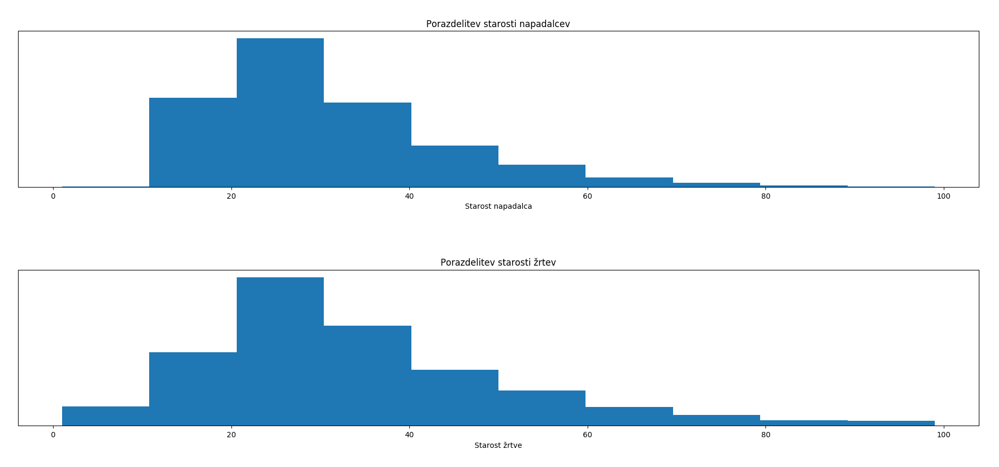

# Vmesno poročilo

## Opis problema

S strani kaggle smo vzeli dataset vseh umorov v ZDA od leta 1980 do 2014. Ta vsebuje več kot 610000 zapisov o kriminalnih aktivnostih, ki so se končale s smrtnim izzidom.

Zastavili smo si sledeča vprašanja/cilje:
- [ ] Razmerje rešenih primerov med tipi policije rezdeljene po državah,
- [ ] Povezava med spolom in uporabljenim orožjem,
- [ ] Ali obstaja povezava med policijami, ki so umor rešili uspešno in raso napadalca.

## Podatki

Med podatki je veliko vrednosti atributov "Unknown", verjetno zaradi nepopolnih poročil ali napak pri vnosih pri digitalizaciji.
Pojavijo se tudi primeri, kjer je število žrtev 0 ali je število napadalcev 0, obstajajo pa tudi zapisi, kjer ni
žrtev niti napadalca. Oziroma so to manjkajoči podatki. Manjka pribljižno **18.93% podatkov** _(všteti samo spol, etnična
pripadnost, starost, rasa, število žrtev ali storilcev)_. So pa vsi podatki, kar se tiče leta, meseca, države, mesta in tipa
državnega organa, ki je primer reševala.

## Vizualizacija

Število poročil glede na uporabljeno orožje

Razmerje rešenih in nerešenih primerov

Število poročil glede na leto

Število poročil glede na leto v Kaliforniji

Število poročil glede na leto v južni Dakoti

Razmeje rešenih primerov proti nerešenim po državah

Razmerje moških morilcev proti ženskim glede na raso

Število poročil glede na mesec

Porazdelitev starosti

## Uporabljena koda

* work.py