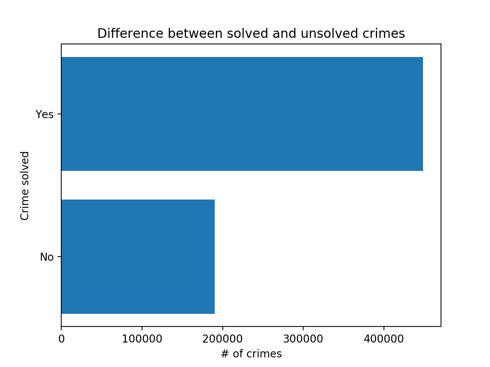

# Vmesno poročilo

## Opis problema

Vzeli smo dataset vseh umorov v ZDA od leta 1980 do 2014, ki vsebuje več kot 610000 zapisov o kriminalnih aktivnostih,
ki so se končale s smrtnim izzidom.

Zastavili smo si sledeča vprašanja/cilje:
- [ ] Razmerje rešenih primerov med tipi policije rezdeljene po državah
- [ ] Povezava med spolom in uporabljenim orožjem
- [ ] Ali obstaja povezava med policijami, ki so umor rešili uspešno in raso napadalca

## Podatki

Med podatki je veliko atributov "Unknown", verjetno zaradi nepopolnih poročil ali napak pri vnosih pri digitalizaciji.
Pojavijo se tudi primeri, kjer je število žrtev 0 ali je število napadalcev 0, obstajajo pa tudi zapisi, kjer ni
žrtev niti napadalca. Oziroma so to manjkajoči podatki. Manjka pribljižno 18.93% podatkov (všteti samo spol, etnična
pripadnost, starost, rasa, število žrtev ali storilcev). So pa vsi podatki, kar se tiče leta, meseca, države, mesta in tipa
državnega organa, ki je primer reševala.

## Vizualizacija

Število poročil glede na uporabljeno orožje

Razmerje rešenih in nerešenih primerov

Število pročil glede na leto

Število pročil glede na leto v Kaliforniji

Število pročil glede na leto v južni Dakoti

## Uporabljena koda

* work.py