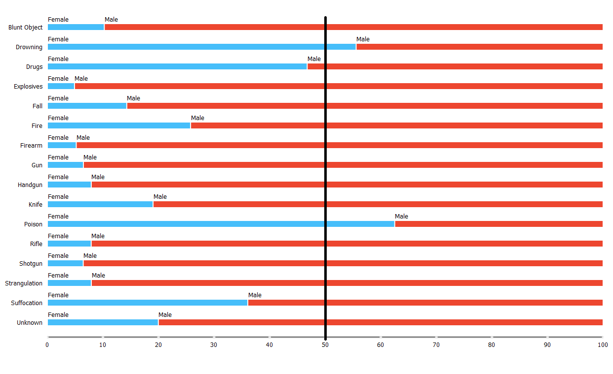
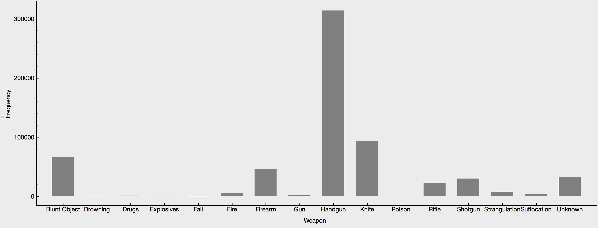
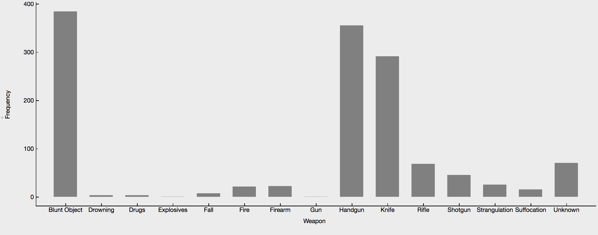

# Analiza umorov v ZDA [1980-2014]

## Opis problema

S strani kaggle smo vzeli dataset vseh umorov v ZDA od leta 1980 do 2014. Ta vsebuje več kot 610000 zapisov o kriminalnih aktivnostih, ki so se končale s smrtnim izzidom.

Zastavili smo si sledeča vprašanja/cilje:
- [ ] Razmerje rešenih primerov med tipi policije rezdeljene po državah,
- [ ] Povezava med spolom in uporabljenim orožjem,
- [ ] Ali obstaja povezava med policijami, ki so umor rešili uspešno in raso napadalca
- [ ] Iskanje povezav med umori in napadalcem.

## Podatki

Med podatki je veliko vrednosti atributov "Unknown", verjetno zaradi nepopolnih poročil ali napak pri vnosih pri digitalizaciji.
Pojavijo se tudi primeri, kjer je število žrtev 0 ali je število napadalcev 0, obstajajo pa tudi zapisi, kjer ni
žrtev niti napadalca. Oziroma so to manjkajoči podatki. Manjka pribljižno **18.93% podatkov** _(všteti samo spol, etnična
pripadnost, starost, rasa, število žrtev ali storilcev)_. So pa vsi podatki, kar se tiče leta, meseca, države, mesta in tipa
državnega organa, ki je primer reševala.

## Vizualizacija

### Razmerje spolov žrtev, glede na vrsto umora

Ženske kot žrtve prevladujejo samo pri zadavitvi, zadušitvi in padcu. Pri utopitvi pa sta spola približno izenačena.

### Razmerje spolov storilcev, glede na vrsto umora

V umorih pa ženske prevladujejo pri utopitvi in strupu.

### Razmerje rešenih umorov glede na zvezno državo

Najmanj rešenih umorov je v District of Columbia, ogromna razlika pa se opazi v Montani, kjer jih je največ.

### Število umorov na leto

Nekaj dejavnikov, ki so vplivali na padec oz. rast kriminala:
- v 90ih se poveča število policistov
- 16 september 1994, predsednik Bill Clinton podpiše "Violent Crime Control and Law Enforcement Act", kjer se v obdobju 6 let porabi več kot 30 milijard $ zvezne denarne pomoči
- poveča se število zaporov
- legalizacija splava, kar prepreči kar nekaj zahtevnih otroštev, ki bi po vsej verjetnosti vodila v kriminal
- povišanje prihodka

[Preberi več o umorih](umori_po_letih.md)

#### Število poročil v Kaliforniji po letih

#### Število poročil v južni Dakoti po letih

### Število umorov s posameznim orožjem

#### Na Havajih za razliko od drugod, kot orožje prevladuje topi objekt

### Nekaj razmerij med belci in črnci

#### Vrsta umora

Belci smo bolj nagnjeni k umoru iz malomarnosti.

#### Ne/Rešeni primeri

Med črnci je veliko več primerov ostalo nerešenih.

#### Ne/Rešeni primeri

Razmerje med rasama storilcev in žrtev je približno enako. Mogoče smo pričakovali od belcev več "rasističnih" umorov.

### Razmerje med rešenimi in nerešenimi primeri

### Število poročil glede na mesec

### Porazdelitev starosti napadalcev in žrtev

### Napovedovanje
Z napovedovalnimi modeli poskušamo napovedati ali je bil primer rešen ali ne. Ciljna spremenljivka je torej `Crimes solved`. Iz atributov smo izločili storilčev spol in veroizpoved obeh, tako storilca kot žrtve, saj brez teh dveh atributov naši modeli dosegajo boljše rezultate.

Ocene modelov:

|                     | AUC   |    CA | F1    | Precision | Recall |
|:-------------------:|-------|------:|-------|-----------|--------|
| Classification tree | 0.828 | 0.817 | 0.866 | 0.828     | 0.817  |
| SVM                 | 0.689 | 0.676 | 0.779 | 0.659     | 0.676  |
| Naive bayes         | 0.898 | 0.822 | 0.868 | 0.837     | 0.822  |
| Random forest       | 0.898 | 0.842 | 0.885 | 0.849     | 0.842  |
| CN2                 | 0.873 | 0.810 | 0.863 | 0.814     | 0.810  |

Pri gradnji modelov smo uporabili 6500 primerov, ki smo jih razdelili v učno (75%) in testno (25%) množico.

Pri ocenjevanju smo postopek učenja modelov in ocenjevanja le-teh ponovili 3 krat.

### Neodgovorjena vprašanja
Na vprašanje ***Ali obstaja povezava med policijami, ki so umor rešili uspešno in raso napadalca*** nismo odgovorili. Ugotovili smo, da je premalo ras, ki bi lahko prinesle kakšno zanimivejšo ugotovitev, saj prevladujeta zgolj 2, ostale pa so zanemarljive. 

## Uporabljena koda

* work.py
